<h1 align="left" id="razyanas-title">👋 Hello there! I'm Anas Razy</h1>
<a href="#Anas">
  
</a>
<h3 align="left">Just a student exploring Java and coding</h3>


<p align="left">
  <a href="https://github.com/RazyAnas/RazyAnas">
    
  </a>

  <a href="https://github.com/RazyAnas?tab=followers">
    
  </a>
</p>


- :computer: &nbsp;Connect with me on **[LinkedIn]**

<br><br><br><br>

<h2 align="left">🛠 Tools, Languages & Resources</h2>
<table>
  <tr>
    <td align="center" width="96">
      <a href="#razyanas-tech">
        
      </a>
      <br>Java
    </td>
    <td align="center" width="96">
      <a href="#razyanas-tech">
        
      </a>
      <br>IntelliJ
    </td>
    <td align="center" width="96">
      <a href="#razyanas-tech">
        
      </a>
      <br>VS Code
    </td>
    <td align="center" width="96">
      <a href="https://www.hackerrank.com/anasrazy">
        
      </a>
      <br>HackerRank
    </td>
    <a href="#title">
      
    </a>
  </tr>
</table>


<br><br><br><br>

<h2 align="left">📊 Coding Activity</h2>

> WakaTime stats (auto-updated)

<!--START_SECTION:waka-->

```txt
From: 09 June 2025 - To: 20 June 2025

Total Time: 5 hrs 44 mins

Java   5 hrs 44 mins   █████████████████████████   100.00 %
```

<!--END_SECTION:waka-->


<!-- links -->

[84.51°]: https://github.com/8451 "84.51° Github Home"
[issues page]: https://github.com/MacroPower/MacroPower/issues "MacroPower/issues"
[linkedin]: https://www.linkedin.com/in/anas-razy "Anas Razy LinkedIn"
[homelab]: https://github.com/MacroPower/homelab "MacroPower/homelab"
[blog]: https://jacobcolvin.com/posts/ "My Blog"
