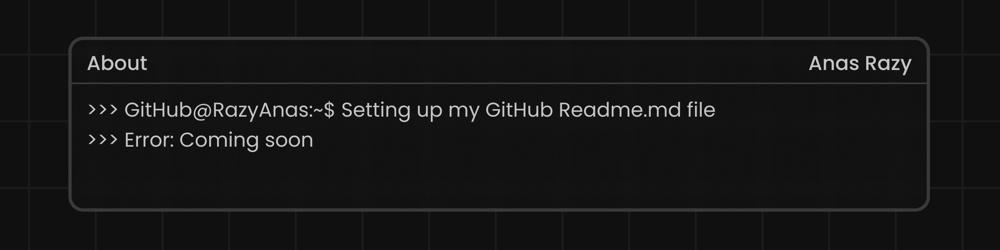

<h2 align="left" id="razyanas-title">>> anas@github:~$ echo "👋 Hello there! I'm Anas Razy"</h2>

<h3 align="left">Just a student exploring Java and coding</h3>
<a href="#Anas">
  
</a>

<p align="left">
  <a href="https://github.com/RazyAnas/RazyAnas">
    
  </a>

  <a href="https://github.com/RazyAnas?tab=followers">
     
  </a>
</p>


- :computer: &nbsp;Connect with me on **[LinkedIn]**

<br><br><br><br><br><br><br>

<h2 align="left">>> anas@github:~$ echo "🛠 Tools, Languages & Resources"</h2>
    <a href="#title">
      
    </a>
<table >
  <tr>
    <td align="center" width="96">
      <a href="#razyanas-tech">
        
      </a>
      <br>Java
    </td>
    <td align="center" width="96">
      <a href="#razyanas-tech">
        
      </a>
      <br>IntelliJ
    </td>
    <td align="center" width="96">
      <a href="#razyanas-tech">
        
      </a>
      <br>VS Code
    </td>
    <td align="center" width="96">
      <a href="https://www.hackerrank.com/anasrazy">
        
      </a>
      <br>HackerRank
    </td>
    <td align="center" width="96">
      <a href="https://wakatime.com/@anasrazy">
        
      </a>
      <br>Waka Time
    </td>
  </tr>
</table>


<br><br><br><br>

<h2 align="left">>> anas@github:~$ echo "📊 Coding Activity>"</h2>

> Coding stats (auto-updated)

<!--START_SECTION:waka-->

```txt
From: 09 June 2025 - To: 25 July 2025

Total Time: 159 hrs 53 mins

Java          158 hrs 43 mins ████████████████████████▓   99.26 %
Text          42 mins         ░░░░░░░░░░░░░░░░░░░░░░░░░   00.45 %
Python        15 mins         ░░░░░░░░░░░░░░░░░░░░░░░░░   00.16 %
Image (svg)   8 mins          ░░░░░░░░░░░░░░░░░░░░░░░░░   00.08 %
Markdown      2 mins          ░░░░░░░░░░░░░░░░░░░░░░░░░   00.03 %
```

<!--END_SECTION:waka-->

> Click below to view more details
<a href="https://wakatime.com/share/@dedc2223-1ebf-48ac-9909-1b3b9059c420/2badc08b-82d1-402f-99bd-15a3e2c69504.svg">
<p align="center">

</p>
</a>

<!-- links -->

[84.51°]: https://github.com/8451 "84.51° Github Home"
[issues page]: https://github.com/MacroPower/MacroPower/issues "MacroPower/issues"
[linkedin]: https://www.linkedin.com/in/anas-razy "Anas Razy LinkedIn"
[homelab]: https://github.com/MacroPower/homelab "MacroPower/homelab"
[blog]: https://jacobcolvin.com/posts/ "My Blog"


