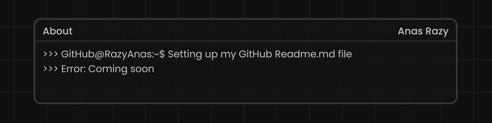

<h2 align="left" id="razyanas-title">>> anas@github:~$ echo "👋 Hello there! I'm Anas Razy"</h2>

<h3 align="left">Exploring UI/UX and Machine Learning</h3>
<a href="#Anas">
  
</a>

<p align="left">
  <a href="https://github.com/RazyAnas/RazyAnas">
    
  </a>

  <a href="https://github.com/RazyAnas?tab=followers">
     
  </a>
</p>


- :computer: &nbsp;Connect with me on **[LinkedIn]**

<br><br><br><br><br><br><br>

<h2 align="left">>> anas@github:~$ echo "🛠 Tools, Languages & Resources"</h2>
    <a href="#title">
      
    </a>
<table >
  <tr>
    <td align="center" width="96">
      <a href="#razyanas-tech">
        
      </a>
      <br>Java
    </td>
    <td align="center" width="96">
      <a href="#razyanas-tech">
        
      </a>
      <br>IntelliJ
    </td>
    <td align="center" width="96">
      <a href="#razyanas-tech">
        
      </a>
      <br>VS Code
    </td>
    <td align="center" width="96">
      <a href="https://www.hackerrank.com/anasrazy">
        
      </a>
      <br>HackerRank
    </td>
    <td align="center" width="96">
      <a href="https://wakatime.com/@anasrazy">
        
      </a>
      <br>Waka Time
    </td>
    <td align="center" width="96">
  <a href="https://leetcode.com/anasrazy/">
    
  </a>
  <br>LeetCode
</td>

  </tr>
</table>


<br><br><br><br>

<h2 align="left">>> anas@github:~$ echo "📊 Coding Activity>"</h2>

> Coding stats (auto-updated)

<!--START_SECTION:waka-->

```txt
From: 09 June 2025 - To: 20 April 2026

Total Time: 259 hrs 55 mins

Java              195 hrs 8 mins        ██████████████████▓░░░░░░   74.80 %
TypeScript        33 hrs 6 mins         ███▒░░░░░░░░░░░░░░░░░░░░░   12.69 %
Python            17 hrs 37 mins        █▓░░░░░░░░░░░░░░░░░░░░░░░   06.76 %
JSON              2 hrs 56 mins         ▒░░░░░░░░░░░░░░░░░░░░░░░░   01.13 %
HTML              2 hrs 9 mins          ▒░░░░░░░░░░░░░░░░░░░░░░░░   00.83 %
```

<!--END_SECTION:waka-->
<figure><embed src="https://wakatime.com/share/@anasrazy/ca100591-dd45-4660-9c41-33bca8f24fce.svg"></embed></figure>
> Click below to view more details
<a href="https://wakatime.com/share/@anasrazy">
<p align="center">

</p>
</a>

<!-- links -->
